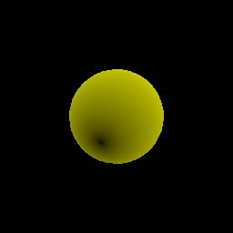

# authwaf (legacy capt gen)

a sketch' sophisticated captcha with little interaction and comphensation. rendering 3d scene without consume too much gpu. helloworld of wgpu!

> how to flush

with average 50, it could generate a simple mesh scene. currently, multiple object has to be merged into 1 vertbuf(?) or just draw over the buffer

